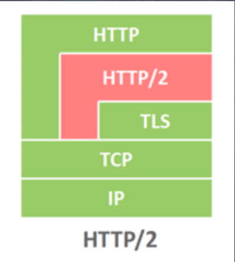
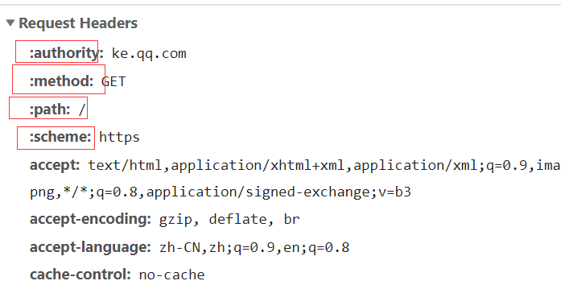
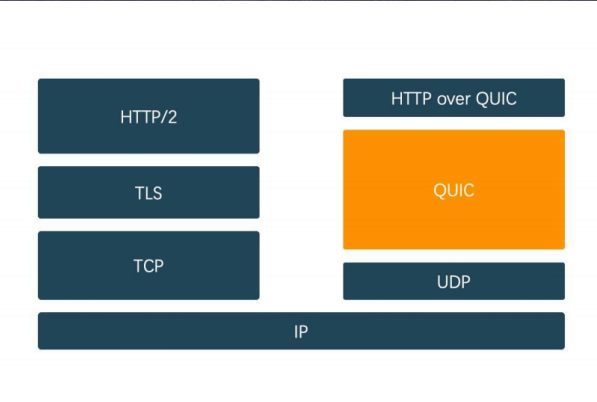

### 概念理解
1. iptable: linux防火墙
2. 正向代理，反向代理
正向代理：
隐藏了真实的请求客户端，服务端不知道真实的客户端是谁，客户端请求的服务都被代理服务器代替来请求，某些科学上网工具扮演的就是典型的正向代理角色。
反向代理：
反向代理隐藏了真实的服务端，当我们请求 www.baidu.com 的时候，就像拨打10086一样，背后可能有成千上万台服务器为我们服务，但具体是哪一台，你不知道，也不需要知道，你只需要知道反向代理服务器是谁就好了， www.baidu.com就是我们的反向代理服务器，反向代理服务器会帮我们把请求转发到真实的服务器那里去。Nginx就是性能非常好的反向代理服务器，用来做负载均衡

3. 防火墙和网关
防火墙：
简单理解，防火墙是防止木马病毒，黑客攻击的屏障
网关：
正常访问外部网站时的审核。

### 互联网五层模型
应用层:负责提供各种服务，http,dns(dns解析),ftp(传输文件),smtp(传输邮件)
传输层:负责端对端通信，tcp 和 udp
网络层:负责主机到主机的通信，ip，(pin数据)
链路层:mac地址(网卡地址)
物理层:网线
### 互联网七层模型
应用层:
表示层:
会话层:
传输层:
网络层:
链路层:
物理层:
### http有哪些方法？
HTTP1.0定义了三种请求方法： GET, POST 和 HEAD方法
HTTP1.1新增了五种请求方法：OPTIONS, PUT, DELETE, TRACE 和 CONNECT

### http的请求报文是什么样的？
### http的响应报文是什么样的？
[链接](https://www.cxymsg.com/guide/http.html#%E8%81%8A%E4%B8%80%E8%81%8Ahttp%E7%9A%84%E9%83%A8%E9%A6%96%E6%9C%89%E5%93%AA%E4%BA%9B%EF%BC%9F)
### http状态码
301: 永久重定向
302: 临时重定向(http1.0)
303: 临时重定向(http1.1对302的细化,请求需要以get请求进行重定向，post请求转为get请求)
307: 临时重定向(http1.1对302的细化, 遵循浏览器规则，不需要全部转成get请求)

400: 请求报文语法错误
401: 需要认证信息
403: 身份证认证错误
404: 服务器找不到资源
408: 客户端请求超时
409: 请求资源冲突
410: 资源丢失

### keep-alive何时断开
http1.1用connect:keep-alive保持长连接，但是浏览器确认后续没有其他请求时，会断开长连接

### https原理个人总结
两个重要核心，对称加密和非堆成加密，密钥的传输是通过非对称加密，内容的传输是对称加密。非对称加密更加耗费性能。

服务端会先花钱和第三方CA机构去申请数字证书，服务端先把自己的公钥和服务端的信息其他有用信息，利用Hash算法生成一个消息摘要。如果数据一旦有一点点变化，生产的消息摘要就会发生巨变。有了这个消息摘要后，利用第三方CA机构的私钥加密，生成数字签名。接着将数字签名和一开始的公钥和其他信息组合成一个数字证书放在服务器上。

客户端发起https请求前，会先请求服务器返回它的数字证书。客户端拿到数字证书后，本地浏览器有内嵌的CA机构的公钥，这时候会做两个事情，数字证书由两部分组成，一部分是数字签名，另一部分是服务器的公钥和有用信息的组合。首先根据信息提供的Hash算法对服务器公钥和信息组合进行hash运算，得到消息摘要。然后利用内嵌的CA机构公钥去解密数字签名，同样得到消息摘要。对比两个消息摘要。如果相同则说明这个公钥是由服务端下发过来的，也是安全。

有了这个公钥，客户端随机生成一个随机数作为后续传输信息的密钥。用刚得到的公钥进行加密，返回给服务端。服务端利用自己的私钥去解密，得到客户端约定好的密钥。之后客户端和服务端利用这个随机生成的密钥进行对称加密通信。

### ssl/tls
两者时继承的关系，最原始的是ssl，后面衍生出tls

传输层安全性协议（Transport Layer Security - TLS），及其前身安全套接层（Secure 
Sockets Layer - SSL）是一种安全协议，目的是为互联网通信提供安全及数据完整性保障。

HTTPS协议的安全性由SSL协议实现，当前使用的TLS协议 1.2 版本包含了四个核心子协
议：握手协议、密钥配置切换协议、应用数据协议及报警协议。

1. TLS适用于对称密钥 
2. 对称密钥可以通过安全密钥交换算法共享 
3. 如果请求被截获，密钥交换可能会被欺骗 
4. 使用数字签名进行身份验证 
5. 证书颁发机构和信任链。

HTTPS协议、SSL协议、TLS协议、握手协议的关系：

HTTPS是Hypertext Transfer Protocol over Secure Socket Layer的缩写，即HTTP 
over SSL，可理解为基于SSL的HTTP协议。HTTPS协议安全是由SSL协议实现的。 
SSL协议是一种记录协议，扩展性良好，可以很方便的添加子协议 
握手协议是SSL协议的一个子协议。 
TLS协议是SSL协议的后续版本，本文中涉及的SSL协议默认是TLS协议1.2版本

### http2概念理解
http2 对协议本身没有修改，只是改变了实现方式，它依旧是基于应用层上的修改，引入了一个新的二进制分帧层。

HTTP/1.x 协议以换行符作为纯文本的分隔符，而HTTP/2 将所有传输的信息分割为更小的消息和帧，并采用二进制格式对它们编码。

### http2的特点
1. 使用二进制格式传输，更高效、更紧凑。
2. 对报头压缩，降低开销。
3. 多路复用
4. 服务器主动推送，减少请求的延迟
5. 默认加密，使用http2，默认是在https的基础上

### 多路复用的理解
由于进行二进制格式的传输，帧之间可以通过标记区分不同的请求响应，所以另一端接收消息只需要组装就可以判断不同的响应，因此客户端同时发起多个请求时，不需要像http1那样建立多次tcp连接，只要在同个tcp连接上同时发送即可。

### 浏览器上如何判断http2请求
http2有专属内置的几个特殊的以":"开始的key。
浏览器访问网站发的第一个请求是http1.1，之后进行协议升级。服务器会告诉客户端协商是否可以使用2.0，客户端响应后才发送2.0的响应。

### 具体的细节
[http2](https://www.cxymsg.com/guide/http.html#https%E6%98%AF%E5%A6%82%E4%BD%95%E4%BF%9D%E8%AF%81%E5%AE%89%E5%85%A8%E7%9A%84%EF%BC%9F)

### http3

http3以前是基于tcp协议的，tcp协议存在队头阻塞的问题是应用层无法解决的。因此http3不在使用tcp协议，而是通过udp + QUIC协议来实现。

特点：
    1.减少了握手的延迟（1-RTT 或 0-RTT）
    2.多路复用，并且没有 TCP 的阻塞问题
    3.连接迁移，（主要是在客户端）当由 Wifi 转移到 4G 时，连接不
    会被断开。

### 队头阻塞问题理解
http1.1和http2同样存在的队头阻塞的问题，http1.1每个tcp只能同时发送一个请求，当有十个请求复用这个tcp连接时，请求是按顺序发送，当其中一个请求丢失，后面的请求都会被阻塞，需要等丢失的请求处理完毕才能继续，浪费了带宽资源。
http2是在应用层层面解决了这个问题，二进制帧的方式让多个请求同时利用tcp连接。但是在传输层，也就是tcp协议中同样存在着队头阻塞的问题。
http2默认是使用https，所以会对内容块进行加密，而加密是对整个块进行加密再分包，如果出现丢包，也会出现阻塞的问题。

http1.1对带宽的利用率并不理想
原因是tcp的慢启动， 滑动窗口和三次握手，
同时开启多条tcp连接，这些连接会竞争固定的带宽

而http2在网络条件差的情况下，丢包严重，队头阻塞问题反而使得带宽的利用率没有http1 好，毕竟是开启了多条tcp连接。

http3在传输层完美的解决了这个问题。QUIC加密的单位是每个包，而不是整个块，所以只需要处理丢失的那部分包即可。并且udp在接收端没有处理顺序，丢失包不会影响整条链路，其他资源会被正常处理。

