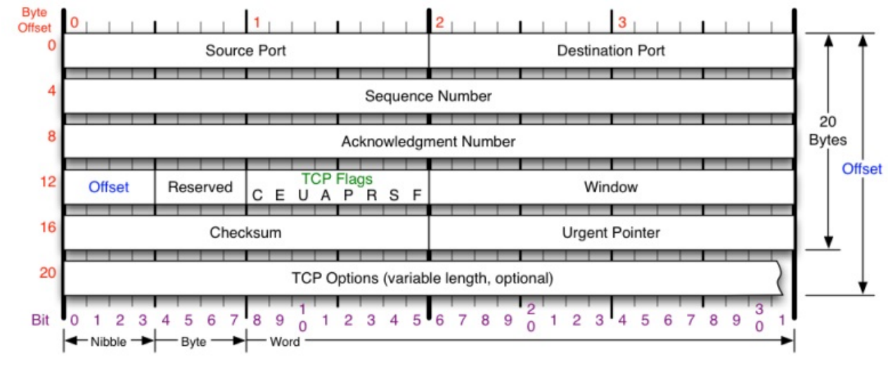

### TCP相关概念的理解
传输层TCP封装完数据后，会在网络层进行分包。TCP会通过包头确定网络包归系统哪一个进程所拥有。(端口冲突是TCP层面的冲突)

tcp层分包还是ip层分包？

分包拆包的意义:

    应用层需要传递的数据有可能是大数据，例如视频，如果不拆包，传输过程出现丢包的时候又需要重复传大数据。所以需要在网络层进行拆包，并且会有编号。但是接收端收到数据时发现有些编号的包丢失，则会通知发送端重新发送丢失的包

TCP协议头至少需要20个字节

0-2 发送方端口

2-4 接收方端口

4-8 sequence number(由发起方来维护)

8-12 acknowledgment number(ack是为了应答发送发发过来的seq number)

12-20 对握手并不重要

16-18 tcp的校验

### 三次握手四次挥手

为什么tcp是稳定协议而udp不是稳定的：
    tcp会保证不管发送方还是接收方都能收到对方发送的消息。
    udp只负责发消息，不保证是否收到。

三次握手是双方能确认对方能够收到自己的包，并且自己也能收到对方的包的最小次数。

SYN是发包的指令。

挥手一般是客户端发起，但是服务端在超时的情况下也会发起断开连接。

断开连接时第二和第三过程为什么不能合并，因为服务器还有收尾工作没有做完，比如资源没有释放，包没有发完等。

如果分开会造成半连接状态(只有一方可以发送)，另一方一直在等待。资源会耗尽(DOS攻击)

