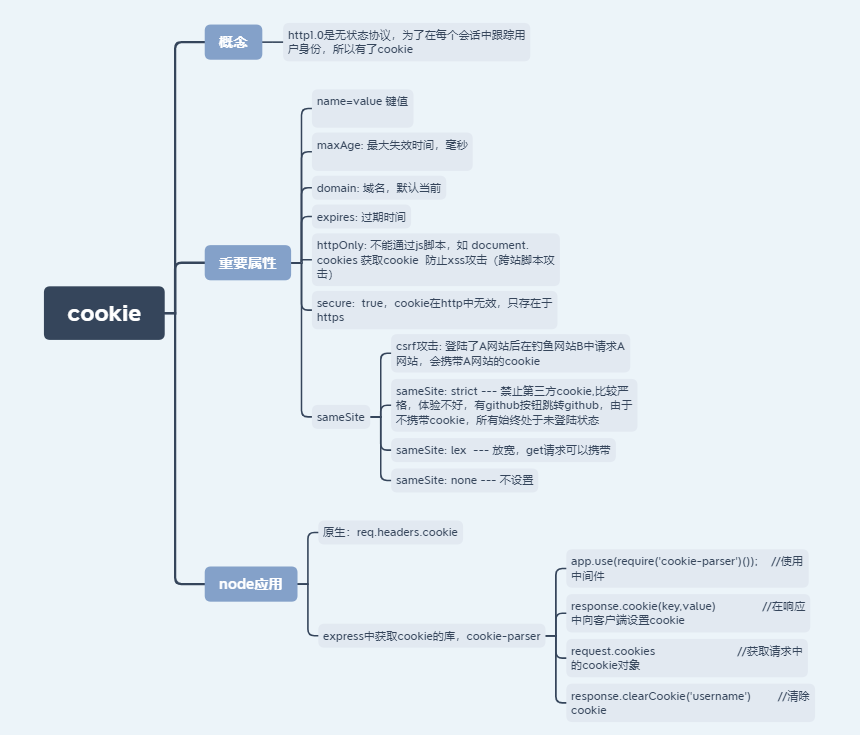

### cookie相关



### cookie-parse的原理
简单讲就是利用中间件，将req.headers.cookie 写道 req.cookies中

```
function cookieParser(secret){
  return function cookieParser(req, res, next){
    req.secret = secret;  
    if (!req.headers.cookie) {
        return next();
    }
    req.cookies =  require('querystring').parse(req.headers.cookie,'; ','=');
    if(req.secret){
        req.signedCookies = {};
        for(let attr in req.cookies){
                let val = req.cookies[attr];
                req.signedCookies[attr] = unsign(val, secret);
            }
        }
    }
    next();
  }
}

function cookie(name, val, options) {
    var opt = options || {};
    val = encodeURIComponent(val);
    if(opt.secret){
        var secret = this.req.secret;
        val = sign(val,this.secret);
    }

    var pairs = [name + '=' + value];

    if (null != opt.maxAge) {
        var maxAge = opt.maxAge - 0;
        if (isNaN(maxAge)) throw new Error('maxAge should be a Number');
        pairs.push('Max-Age=' + Math.floor(maxAge));
    }

    if (opt.domain) {
        pairs.push('Domain=' + opt.domain);
    }

    if (opt.path) {
        pairs.push('Path=' + opt.path);
    }

    if (opt.expires) pairs.push('Expires=' + opt.expires.toUTCString());
    if (opt.httpOnly) pairs.push('HttpOnly=true');
    if (opt.secure) pairs.push('Secure=true');

    return pairs.join('; ');
}

var crypto = require('crypto');
exports.sign = function(val, secret){
  return val + '.' + crypto
    .createHmac('sha256', secret)
    .update(val)
    .digest('base64')
    .replace(/\=+$/, '');
};

exports.unsign = function(val, secret){
  var str = val.slice(0, val.lastIndexOf('.'))
    , mac = exports.sign(str, secret);
  return mac == val ? str : false;
};

```