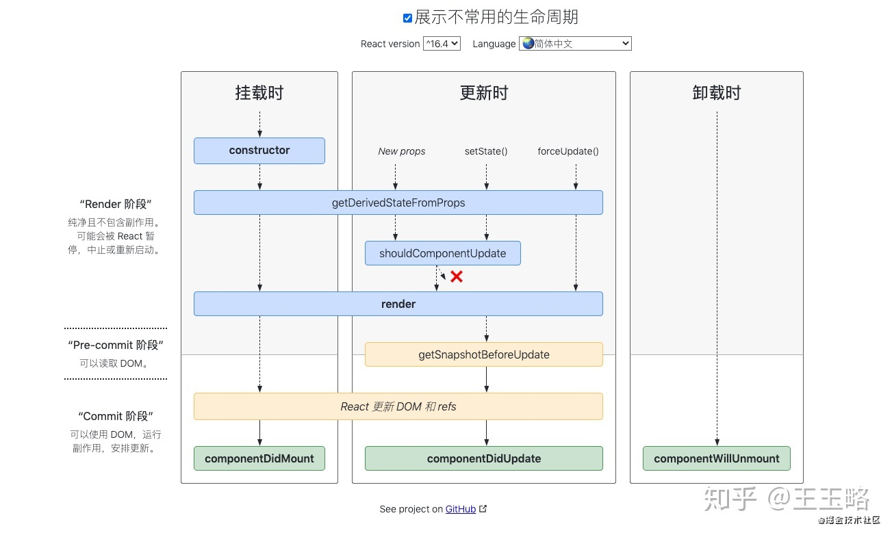

### React16废弃的三个生命周期函数

```js
componentWillMount
componentWillReceiveProps
componentWillUpdate
```

> 注：目前在16版本中componentWillMount，componentWillReceiveProps，componentWillUpdate并未完全删除这三个生命周期函数，而且新增了UNSAFE_componentWillMount，UNSAFE_componentWillReceiveProps，UNSAFE_componentWillUpdate三个函数，官方计划在17版本完全删除这三个函数，只保留UNSAVE_前缀的三个函数，目的是为了向下兼容，但是对于开发者而言应该尽量避免使用他们，而是使用新增的生命周期函数替代它们

