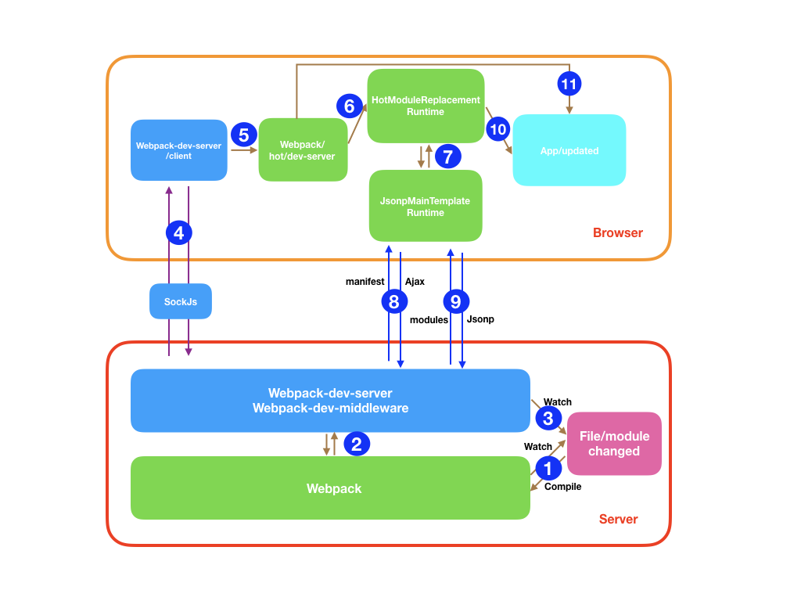

### webpack刷新
刷新分为两种：
1. 页面刷新，不保留页面状态，直接```window.location.reload()```
2. 基于webpack-dev-server的模块热替换，保留页面状态


### 开启模块热更新的步骤
- 使用webpack-dev-server作为服务器启动
- devServer配置中 hot：true
- plugins hotModuleReplacementPlugin
- js代码中添加module.hot.accept 增加hmr代码

### webpack编译构建过程
webpack的每次打包编译，都会生成新的hash值。
```
新的Hash值：a61bdd6e82294ed06fa3
新的json文件： a93fd735d02d98633356.hot-update.json
新的js文件：index.a93fd735d02d98633356.hot-update.js
```

浏览器会请求json文件和打包后新的js文件
```
// hot-update.json
{
    h: 2343214dsfa, //  h代表hash
    c: {            // c代表content
        index: true // true表示模块需要更新
    }
}
```


### 热更新的原理

总结： webpack实现热更新主要依赖于三部分，webpack-dev-server webpack-dev-middleware，hotModuleReplacementPlugin插件。

(webpack-dev-server集成了webpack-dev-middleware,如果不使用webpack-dev-server，可以使用webpack-hot-middleware和webpack-dev-middleware配合使用，后两者皆为express的中间件)


webpack-dev-server负责启动http服务。并且启动websocket连接，而wdm则负责文件处理监听部分。

1. 执行webpack，会生成compiler实例，webpack同时有--watch配置来实现对文件改变的监听，从而执行启动再次编译工作。(监听文件的原理是通过轮询的方式监听文件修改时间是否发生改变)
2. webpack-dev-server启动express服务器，方便请求静态资源。同时建立websocket连接
3. websocket是双向连接，dev-server只是服务端，客户端需要嵌入websocket连接的代码，所以需要在代码打包时嵌入客户端socket代码。
4. 为了实现步骤3，webpack会修改entry入口，将两段js代码嵌入到打包后代码中。
    ```
    // 修改后的entry入口
   { entry:
       { index: 
           [
               // websocket客户端代码
               'xxx/node_modules/webpack-dev-server/client/index.js?http://localhost:8080',
               // 检测执行模块更新的代码
               'xxx/node_modules/webpack/hot/dev-server.js',
               // 开发配置的入口
               './src/index.js'
       	],
       },
   }  
    ```
5. webpack暴露了done的钩子，每次构建完毕会触发钩子，webpack-dev-server监听该钩子，触发时通过websocket推送到客户端,（hash 和 ok）

```
// 通过websoket给客户端发消息
_sendStats() {
    this.sockWrite(sockets, 'hash', stats.hash);
    this.sockWrite(sockets, 'ok');
}
```

6. --watch的底层是webpack-dev-middle中间件，负责监听文件的变化,每次编译的结果也只会输出到内存，不会写到文件中，核心是memory-fs这个库

7. 客户端接收到服务端推送的websocket后，拿到hash值和是否发生文件内容改变的ok标志。然后调用module.hot.check去检测模块是否发生更新。

8. 检测这个过程，需要重新交给webpack处理，前面提到第三个关键的插件是 hotModuleReplacementPlugin，他负责做的事情就是将check方法打包到源码中。
```
没有配置hotModuleReplacementPlugin的打包代码
···
var module = installModules[moduleId] = {
    i: moduleId,
    l: false,
    exports: {}
}

配置hotModuleReplacementPlugin的打包代码

var module = installModules[moduleId] = {
    i: moduleId,
    exports: {},
    hot: hotCreateModule(moduleId)
}
```

9. hotCreateModule有check方法，这个方法就是上面检测的关键，check首先利用上一次的hash去请求hot-update.json文件，接着通过jsonp的方式去请求hot-update.js

10. js返回的代码是在webpackHotUpdate函数体内。而jsonp的方式也方便立即执行。

11. 最终webpack会把旧的模块删除，然后通过_webpack_require()加载新模块的代码。


12. 错误处理：热更新失败，会通过调用location.reload()对整个页面进行刷新。


流程图如下：
