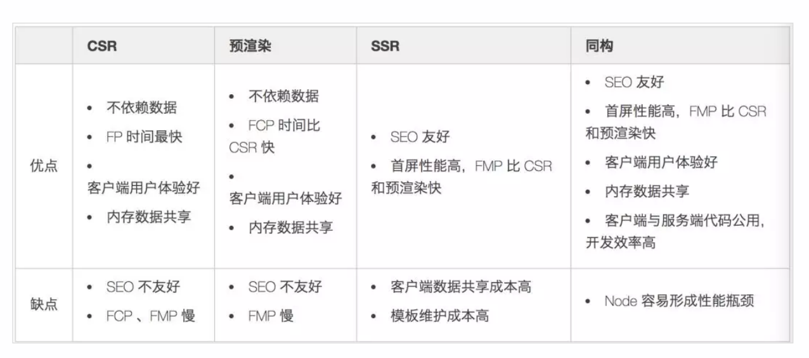

### 性能优化的场景

谷歌v8引擎有即时编译的系统，对于多次运行的代码会直接编译成机器码进行缓存

**缓存是优化网站性能最有效的手段，核心原则是小**

重要手段：(部分可参考雅虎军规的总结)

1. 减少dom的数量，优化css
2. 压缩合并js，css
3. cdn，针对多个js文件在同域名下请求数量的限制，cookie会在同域名下传递，如果将图片资源放到其他域名下会减少资源开销。
4. http2，keep-alive服务端设置，gzip
5. 判断用户的网络类型
    - 冷启动： 用户第一次访问应用，加上网速过慢，可以返回一个简版，只有少量资源的版本。
    - 判断网络类型进行分流：

      - 1. 利用html5提供的api

        ```navigator.connection ``` 
        
        ```
          NetworkInformation {
          downlink: 0.35, 
          effectiveType: "2g", // 2g网络
          onchange: null, 
          rtt: 1800, // 一次请求往返时间
          saveData: false
        } 
        ``` 

      - 2. 纯图片请求测速

           前端src发送一张1kb的图片，得到来回的时间差，算出网速。

      - 3. 多普勒测速

            纯图片无法测出纯的rtt时间，因为中间还要经过dns解析，tcp连接等。

6. 离线缓存

    
    利用localstorage对静态资源进行缓存，可以有效的控制资源的更新和加载。脚本初次执行会放到localstorage里，再次请求时如果localstorage存在，则不需要浪费网络请求。通过js的hash值判断是否是过期的资源。可以代替浏览器的缓存(etag)，更稳定可控,可以控制多版本的切换(回到旧版)
```

<script>
// webpack打包后对应的资源文件版本号
var lists = {
  jquery: "https://cdn.bootcdn.net/ajax/libs/jquery/3.5.1/jquery.js"
}

// 有缓存，且缓存版本和服务器一致
if (localStorage['jquery'] && localStorage['jquery'] === lists.jquery) {
  
  function loadjs(content) {

    var container = document.getElementsByTagName('head')[0];
    var script = document.createElement('script')
    script.type = "text/javascript"
    script.text = content;
    
    container.appendChild(script)

  }
  // 拿到localstorage里存储的脚本资源，加载缓存内容，添加script脚本
  loadjs(localStorage[lists.jquery])
} else {
  // 没有缓存，直接加载资源
  fetch(lists.jquery).then(data => data.text()).then(data => {

    localStorage.setItem('jquery', lists.jquery);
    localStorage.setItem(lists.jquery, data)

  })
}
</script>
```

如果资源过多，可以利用iframe对localstorage进行扩容，缺点是他是异步操作。

### 缩短白屏时间的策略

1. 通过内联 JavaScript、内联 CSS 来移除这两种类型的⽂件下载，这样获取到 HTML ⽂件之后就可 以直接开始渲染流程了
2. 但并不是所有的场合都适合内联，那么还可以尽量减少⽂件⼤⼩，⽐如通过 webpack 等⼯具移除 ⼀些不必要的注释，并压缩 JavaScript ⽂件 
3. 可以将⼀些不需要在解析 HTML 阶段使⽤的 JavaScript 标记上 sync 或者 defer。 
4. 对于⼤的 CSS ⽂件，可以通过媒体查询属性，将其拆分为多个不同⽤途的 CSS ⽂件，这样只有在 特定的场景下才会加载特定的 CSS ⽂件。

### 首屏渲染的几个概念

FP： （First Paint）首次绘制首次绘制时间，标记浏览器渲染任何在视觉上不同于导航前屏幕内容的时间点，第一次请求html回来绘制的时间。

FCP： （First Content Paint）: 首次内容绘制，标记的是浏览器渲染第一针内容 DOM 的时间点，该内容可能是文本、图像、SVG 或者 ```<canvas>``` 等元素

FMP（First Meaning Paint）：首次有效绘制，标记主角元素渲染完成的时间点，主角元素可以是视频网站的视频控件，内容网站的页面框架也可以是资源网站的头图等。衡量一个网站用户体验的标准一般使用FMP。

### 几种架构方案的首屏渲染


##### 1. CSR（spa应用)
spa应用，也被成为单页面应用，单页面应用的输出一般只有一个空的html和脚本。这种渲染方式成为 CSR（客户端渲染），而seo爬取的是html上的标签，包括key，description，title, h1等关键字。所以我们选型CSR渲染的应用是不需要做seo优化的应用，例如应用大部分的有用信息需要登录（seo无法爬取用户登录后的页面）。这个时候用其他渲染方式做SEO优化并没有意义。

image CSR 在 FP 时间是最快的。因为他的html文件基本是一个空文件，所有他的初始绘制时间非常快，但是 FCP 和 FMP 的时间会比较慢，他要经过等待文件加载、CSSOM 构建、JS 解析的过程


例子： FP(以vue为例)：<div id="app"></div> FTP: <div id="app">div···</div> FMP： 完整页面

##### 2、SSR

ssr简单理解就是服务端渲染，服务端将数据拼接到html，并将html直接返回。由于直接返回的是html，所以SEO友好，并且首屏性能较高， 缺点在于维护模板成本，并且客户端数据共享的成本较高(csr应用数据共享比较简单，最常规的例子是vuex利用内存存储数据，而ssr每个页面之间是独立的url，数据共享比较麻烦，可以利用localstorage等)。

FP的性能主要消耗在服务端获取数据拼接的过程，而FMP和FCP 几乎和FP一致，速度较快。

##### 3、预渲染

预渲染会将FCP的时间提前，在单页面基础上做的一层处理，有利于seo和首屏等待渲染时间，但是不会改变FMP的时间。

以vue 为例 有prerender-spa-plugin

##### 4、同构
前后端同个模板，(nuxt)
- 1. 刷新页面ssr  造成首页的html巨大，开启bigpipe(header  Transfer-Encoding: chunked) - buffer
- 2. 切页用csr
    后端分析请求头 ctx.render   ->  ctx.json({
        html: ,
        css: ,
        js: ,
    })
    返回改变的html内容，脚本，样式
    页面操作按钮是a连接(pjax)，或者前端请求头加特殊标志
- 3. 利用prefetch资源，让浏览器再空闲的时候先加载可视区a链接的资源。(例如使用quicklink)





### Bigpipe
buffer输出
```
// 非bigpipe
await ctx.render('index', datas)
//bigpipe
const html = await ctx.render('index', datas);
function createReadStream() {
    return new Promise((resolve, reject) => {
    const htmlStr = new Readable()
    htmlStr.push(html)
    htmlStr.push(null)
    ctx.status = 200;
    ctx.type = "html"

    htmlStr.on('error', (err) => reject(err)).pipe(ctx.res)
    })
}
await createReadStream()
```


### node压测工具
wrk ab


### 性能指标
DCL: domContentLoaded，dom完成加载解析
FP：首次绘制，对单页面而已是一个首页div标签
FCP：首次出现内容时间，开始渲染dom
LCP：页面中最大元素加载事件
FMP：首次有效绘制，一般是onload事件
FID: 用户首次交互和浏览器实际响应交互的时间，一般是在TTI和FMP之间，越靠近FMP，FID时间越长。
TTI：指标用于标记应用已进行视觉渲染并能可靠响应用户输入的时间点
```const TTITime = timing.loadEventEnd - timing.navigationStart```
TBT: 衡量从FCP到TTI之间主线程被阻塞时长的总和。
CLS: 布局偏移
### 性能分析的工具
chrome  
  performance：long task， 耗时分析，卡顿分析，内存分析
  lighthouse：seo，详细的性能指标：TTI，FCP，诊断，安全性问题
  pageSpeed: 分析的