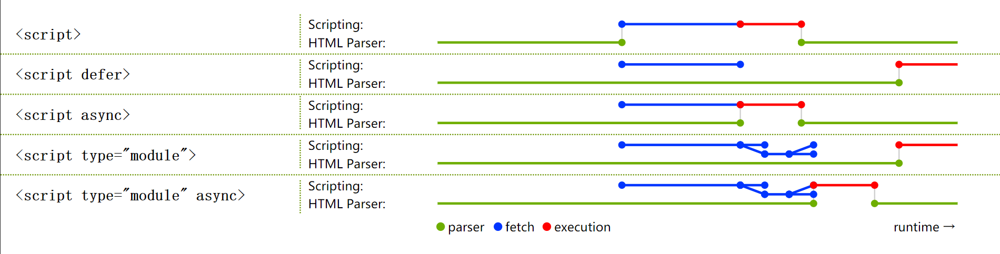

script标签用来在网页中执行JavaScript，它可以直接包含JavaScript代码，也可以直接通过src指向一个同域或者不同域的外链。

### 1. script标签默认会阻塞页面解析，并按照它们出现的顺序执行
```js
<script src="a.js"></script>
<script>
  console.log('b')
</script>
<script src="b.js"></script>
```

浏览器在解析到上面的script标签时会阻止页面解析，并平行下载a.js, b.js，依次执行a.js, console.log('b'), b.js 后，再继续解析渲染页面。这也是为什么你会经常看到一些建议将需要DOM操作的js要放在body的最后，不阻塞页面html的解析。

### 2. script标签的async和defer 属性

- async 仅适用于外链，规定脚本异步执行
下载不会阻塞页面解析
不会按照出现的顺序执行，先下载完成哪个就先执行哪个
执行的时候，有可能页面还没解析完成
- defer仅适用于外链，规定脚本延迟执行
不会阻塞页面解析
在html解析完成后, DOMContentLoaded之前执行
会按照出现的顺序执行

### 3. type为module的script标签
相比传统script，<script type="module"></script>将被当作一个JavaScript模块对待，被称为module script，且不受charset和defer属性影响。

```js
// app.js
import { assign } from "./utils.js"

var obj = Object.create(
  { foo: 1 }, 
  {
    bar: { value: 2 },
    baz: { value: 3, enumerable: true }
  },
)
var copy = assign({}, obj)
console.log(copy)
<script type="module" src="app.js"></script>
<script nomodule src="classic-app-bundle.js"></script>
```

上面的代码，可以这么理解：

- 支持module script的浏览器，不会执行拥有nomodule属性的script
- 不支持module script的浏览器，会忽略未知的type="module"的script，同时也会忽略传统script中不认识的nomodule属性，进而执行传统的bundle.js代码
- module script以及其依赖所有文件（源文件中通过import声明导入的文件）都会被下载，一旦整个依赖的模块树都被导入，页面文档也完成解析，app.js将会被执行

但是如果module script里有async属性，比如<script type="module" src="util.js" async></script>，module script及其所有依赖都会异步下载，待整个依赖的模块树都被导入时会立即执行，而此时页面有可能还没有完成解析渲染。

传统script和module script如何被下载执行可以用下图来概括：



### 4.script标签的integrity属性

```<script crossorigin="anonymous" integrity="sha256-PJJrxrJLzT6CCz1jDfQXTRWOO9zmemDQbmLtSlFQluc=" src="https://assets-cdn.github.com/assets/frameworks-3c926bc6b24bcd3e820b3d630df4174d158e3bdce67a60d06e62ed4a515096e7.js"></script>```

integrity属性是资源完整性规范的一部分，它允许你为script提供一个hash，用来进行验签，检验加载的JavaScript文件是否完整。

上面的代码来自github源码， integrity="sha256-PJJrxrJLzT6CCz1jDfQXTRWOO9zmemDQbmLtSlFQluc="告诉浏览器，使用sha256签名算法对下载的js文件进行计算，并与intergrity提供的摘要签名对比，如果二者不一致，就不会执行这个资源。

intergrity的作用有：

- 减少由【托管在CDN的资源被篡改】而引入的XSS 风险
- 减少通信过程资源被篡改而引入的XSS风险（同时使用https会更保险）
-  可以通过一些技术手段，不执行有脏数据的CDN资源，同时去源站下载对应资源


### 5. crossorigin
概念：在HTML5中，一些 HTML 元素提供了对 CORS 的支持， 例如 ```<audio>、、<link>、<script>``` 和 ```<video>``` 均有一个跨域属性 (crossOrigin property)，它允许你配置元素获取数据的 CORS 请求。 

例如：script标签中crossorigin="anonymous",在错误采集中，引入跨域的脚本，如果这个脚本有错误，因为浏览器的限制，当你尝试用window.error去捕获脚本错误时，是拿不到错误信息的，只能拿到script error的错误。
crossorigin的作用是告诉服务端，这是个允许跨域的操作，如果此时服务端允许跨域，则会在响应中通过access-controll-allow-origin允许跨域。这时可以拿到详细的脚本错误信息。

其他的还有诸如canvas中使用跨域的img元素。用img元素判断网速时，都需要在元素上增加跨域属性。


### 6. 动态导入script(Dynamically importing scripts)

```js
function loadError (error) {
  throw new URIError(`The script ${error.target.src}  is not accessible.`)
}

function importScript (src, onLoad) {
  var script = document.createElement('script')
  script.onerror = loadError
  script.async = false
  if (onLoad) { script.onload = onLoad }
  document.header.appendChild(script)
  script.src = src
}
```

`可以上面的方法动态加载js资源，但是要注意的是，默认append到文档中的script会异步执行（可以理解为默认拥有async属性，如果需要加载的js按顺序执行，需要设置async为false）`

