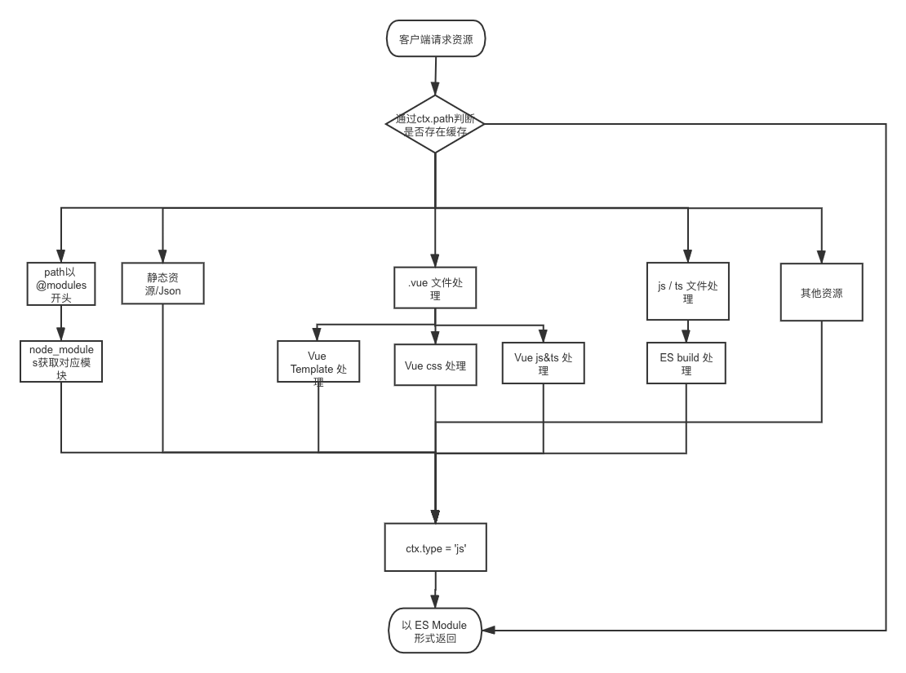

### Vite是什么？

一个基于浏览器原生 ES Modules 的开发服务器。利用浏览器去解析模块，在服务器端按需编译返回，完全跳过了打包这个概念，服务器随起随用。支持热更新，而且热更新的速度不会随着模块增多而变慢。


### vite的特点
1. 启动速度快
2. 热更新
3. 按需编译


### 概念理解
vite底层是esbuild，esbuild是基于ESM打包，从Vite 的README上可以发现esbuild的执行速度非常快，typescript转义成javascript要比官方的tsc快20-30倍。


esbuild和webpack的区别，只负责处理js和ts，而webpack有大量的loader和插件系统。

### webpack的缺点
webpack打包过程是将多个模块合成一个chunk，而当其中有模块发生改变时，需要重新打包chunk，而随着项目的增加，模块的增长，重新打包(热更新)的速度会越来越慢，所以会有类似cache-loader这样的优化。


### esbuild对模块的打包合并

esbuild底层是go

```js
// foo.js
export const fn = () => 123
// bar.js
import {fn} from './foo'
console.log(fn())
```

编译后的结果
```js

(modules => {
  let map = {}
  function require(id) {
    if (!(id in map)) {
      map[id] = {}
      modules[id](require, map[id])
    }
    return map[id]
  }
  require(0)
})({
  0:(require, exports) {
    // foo.js
    const fn = () => 123
    // bar.js
    console.log(fn())
  }
})

```

### vite的流程图

   
#### 请求拦截
vite会启动一个koa服务器去拦截esmodule请求，将指定模块返回给浏览器。

1. js-ts： esbuild打包处理，速度快
2. vue文件：拆分为template，css，js，交给不同的模块去处理返回。
3. node_module模块：依赖模块可能嵌套包含了多个模块。这时候浏览器会发起多个请求。vite做的优化是将这些依赖分别单独达成一个esm模块。例如项目的 package.json 的 dependencies 如下（有点 windows 和 webpack dll 的感觉）。假如一个包有很多内部模块，例如：lodash-es有超过 600 个内部模块，经过 vite 处理后也只会生成 lodash-es.js 这一个文件，vite 会将 Pre-bundling 后的模块 cache 在当前项目 node_modules/.vite 文件夹下，Pre-bundling 花费的时间其实就是第一步和第二步花费的时间

```/:id 转化为 /@modules/:id```
(通过实际的路由访问，浏览器加载 HTML script 中 esm 模块的入口文件。 浏览器会解析入口文件，自动根据入口文件的 import 关系下载缓存在项目 node_modules/.vite 文件夹下依赖的其他 esm 模块并使用。页面刷新或 HMR，对于请求的资源，dev server 会返回 304 Not Modified 和 200 OK (from disk cache) cache，充分利用浏览器特性来完成之前 webpack 寻找依赖和打包的处理过程)


### 相关文章
[vite源码](https://juejin.cn/post/6881078539756503047)


