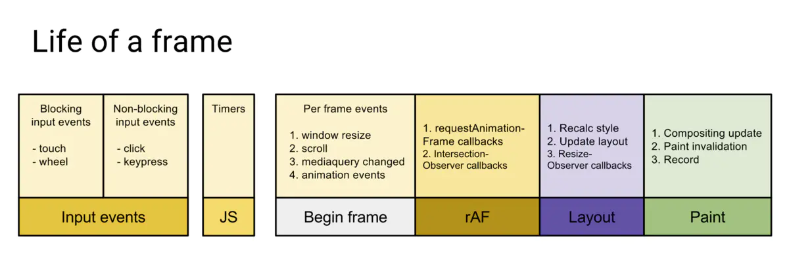
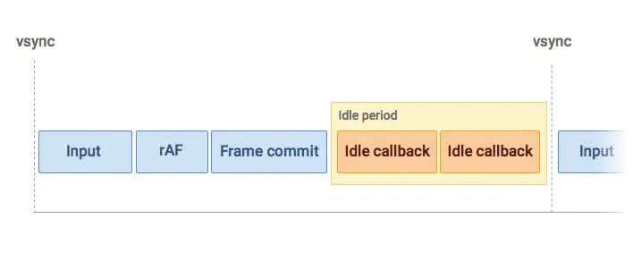

### 页面流畅与 FPS
页面是一帧一帧绘制出来的，当每秒绘制的帧数（FPS）达到 60 时，页面是流畅的，小于这个值时，用户会感觉到卡顿。

1s 60帧，所以每一帧分到的时间是 1000/60 ≈ 16 ms。所以我们书写代码时力求不让一帧的工作量超过 16ms。

### Frame
那么浏览器每一帧都需要完成哪些工作？



通过上图可看到，一帧内需要完成如下六个步骤的任务：

1. 处理用户的交互
2. JS 解析执行
3. 帧开始。窗口尺寸变更，页面滚动等的处理
4. requestAnimationFrame(rAF)
5. 布局
6. 绘制


### requestIdleCallback

上面六个步骤完成后没超过 16 ms，说明时间有富余，此时就会执行 requestIdleCallback 里注册的任务。




从上图也可看出，和 requestAnimationFrame 每一帧必定会执行不同，requestIdleCallback 是捡浏览器空闲来执行任务。

如此一来，假如浏览器一直处于非常忙碌的状态，requestIdleCallback 注册的任务有可能永远不会执行。此时可通过设置 timeout （见下面 API 介绍）来保证执行。

```var handle = window.requestIdleCallback(callback[, options])```

超时的情况，其实就是浏览器很忙，没有空闲时间，此时会等待指定的 timeout 那么久再执行，通过入参 dealine 拿到的 didTmieout 会为 true，同时 timeRemaining () 返回的也是 0。超时的情况下如果选择继续执行的话，肯定会出现卡顿的，因为必然会将一帧的时间拉长。

### 总结
一些低优先级的任务可使用 requestIdleCallback 等浏览器不忙的时候来执行，同时因为时间有限，它所执行的任务应该尽量是能够量化，细分的微任务（micro task）。

因为它发生在一帧的最后，此时页面布局已经完成，所以不建议在 requestIdleCallback 里再操作 DOM，这样会导致页面再次重绘。DOM 操作建议在 rAF 中进行。同时，操作 DOM 所需要的耗时是不确定的，因为会导致重新计算布局和视图的绘制，所以这类操作不具备可预测性。

Promise 也不建议在这里面进行，因为 Promise 的回调属于 Event loop 中优先级较高的一种微任务，会在 requestIdleCallback 结束时立即执行，不管此时是否还有富余的时间，这样有很大可能会让一帧超过 16 ms。


### requestAnimationCallback
在没有 requestAnimationFrame 方法的时候，执行动画，我们可能使用 setTimeout 或 setInterval 来触发视觉变化；但是这种做法的问题是：回调函数执行的时间是不固定的，可能刚好就在末尾，或者直接就不执行了，经常会引起丢帧而导致页面卡顿。


归根到底发生上面这个问题的原因在于时机，也就是浏览器要知道何时对回调函数进行响应。setTimeout 或 setInterval 是使用定时器来触发回调函数的，而定时器并无法保证能够准确无误的执行，有许多因素会影响它的运行时机，比如说：当有同步代码执行时，会先等同步代码执行完毕，异步队列中没有其他任务，才会轮到自己执行。并且，我们知道每一次重新渲染的最佳时间大约是 16.6 ms，如果定时器的时间间隔过短，就会造成 过度渲染，增加开销；过长又会延迟渲染，使动画不流畅。

requestAnimationFrame 方法不同与 setTimeout 或 setInterval，它是由系统来决定回调函数的执行时机的，会请求浏览器在下一次重新渲染之前执行回调函数。无论设备的刷新率是多少，requestAnimationFrame 的时间间隔都会紧跟屏幕刷新一次所需要的时间；例如某一设备的刷新率是 75 Hz，那这时的时间间隔就是 13.3 ms（1 秒 / 75 次）。需要注意的是这个方法虽然能够保证回调函数在每一帧内只渲染一次，但是如果这一帧有太多任务执行，还是会造成卡顿的；因此它只能保证重新渲染的时间间隔最短是屏幕的刷新时间
