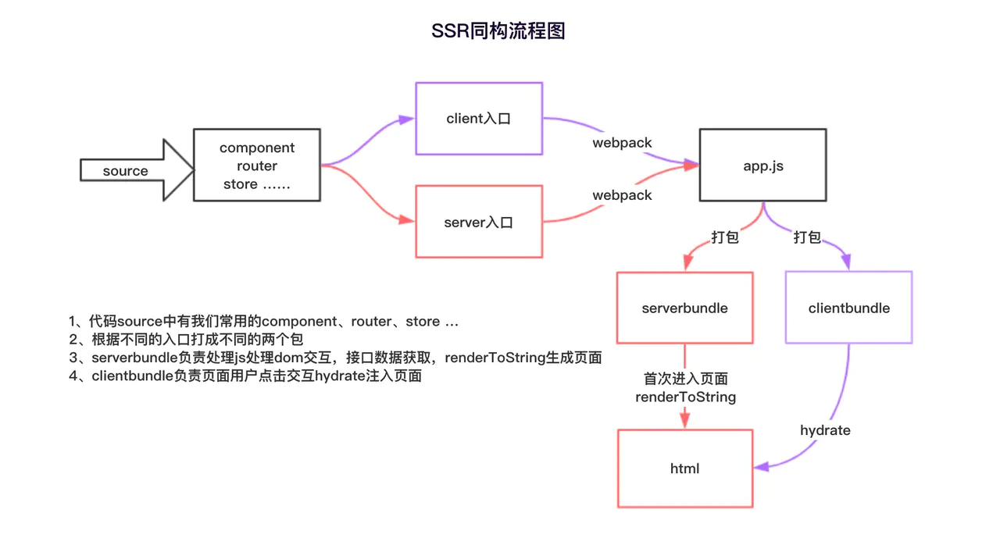

### SSR的理解和实现
SSR结合了SPA和MPA架构，首页和页面刷新时采用服务端直出，而页面内部跳转采用js控制，相当于真假路由混合。

基本架构图

系统架构分为服务端和客户端，服务端将vue，react组件通过renderToString转换为html模板，然后通过koa或者express直出，这样首页渲染时就是完整的html js css。

如果需要在组件渲染前请求数据，spa架构会放在如 mounted或者componentDidMount生命周期中执行，这样会造成首屏渲染需要核外的http请求，借用mpa的理念，可以在直出html前进行数据的获取。

做法:

    可以在组件中定义一个静态方法，在路由直出前调用方法进行服务端接口的请求。最后将请求结果放到模板中返回到客户端。
    
    为了让服务端请求的数据在客户端也能共用，有两个核心步骤。
    1. 借用redux或者vuex的状态管理存储数据
    2. 将服务端请求的数据注水到window对象中，这样客户端通过window对象可以取到存储的数据。

#### 如何做到真假路由混用
服务端需要配置路由，每个路由都是重新返回服务端完整数据。客户端用前端路由控制，