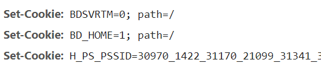

### cookie
cookie有哪些属性

name

value

domain: 域名

path: 路径

expires: 过期时间

max-age: 过期时间

httponly: 不允许通过document.cookie获取

secure： 只允许在https中传输

sameSite:是否为同站cookie（strict, lax）

浏览器每个域名下面最多有50个cookie，如果超过浏览器会自动删除

服务器cookie的下发是逐条下发的

### 第三方cookie
什么叫第三方cookie，当打开一个网站时，除了本域名下携带cookie外，还有一些第三方网站也会携带有cookie，这个cookie就是第三方cookie。

用途：
    前端日志打点: 大多数web站点都会引用第三方的sdk来进行前端的异常或者性能监控，常规的用法就是在自己的代码中加入第三方提供的javascript脚本，而脚本执行请求时，第三方网站会通过set-cookie注入cookie作为后续异常上报的用户凭证。
    
    不同子系统的登陆: 已经登陆淘宝，从百度链接重新进入淘宝，如果没有限制第三方cookie，则进入淘宝不用重复登陆，如果限制了，则需要重新登陆。(淘宝天猫的单点登陆也是一个道理，同个集团下的两个子系统，有一套共同的登陆服务，淘宝登陆后会在第三方登陆服务下保留cookie)

危害：
    第三方cookie的最大危害就是容易被利用做csrf攻击(跨站请求伪造)

浏览器现状：
    目前浏览器有sameStrict属性可以设置是否允许第三方cookie的存在，firefox,safari是默认禁用的，而chrome目前还比较灵活。samestrict有三个属性可以选择

    strict: 禁止
    lax: lax提供了一个权衡，get请求不阻止，post请求会被阻止。
    none: 跨站也可以继续发送。

禁用第三方cookie的影响:
    前端日志异常监控受到影响
    广告推荐这些会消失
    好处是用户隐私会被保护。
    
### token

#### jwt： 
##### 原理
服务端验证完身份后，会利用用户的json对象里的信息，通过签名的算法（algorithm），默认是 HMAC SHA256（写成 HS256），利用自己密钥返回一个签名后的字符串给用户。客户端在收到jwt后，会将他保存在localstorage或者cookie，在下次请求时在authorization字段加上token。后台收到请求后，拿到token会利用同样的算法和密钥将token解析出来，如果是同一个用户则认证成功。
##### 缺点
由于服务器不保留session信息，因此使用过程中无法废止某个token，或者更改token的权限

### 另外一种方式
##### 原理
验证完身份后，后台随机生成一个uuid，之后用md5进行加密，服务器将这个加密后的token和用户关联存储在数据库中，token返回给客户端后，每次请求也同样会在authorization上携带token，后台只要验证token是否为对应用户即可。

##### 缺点
典型的用空间换时间的概念。服务端需要定时更新token。但是相比前者而言，可以废止某个token

    