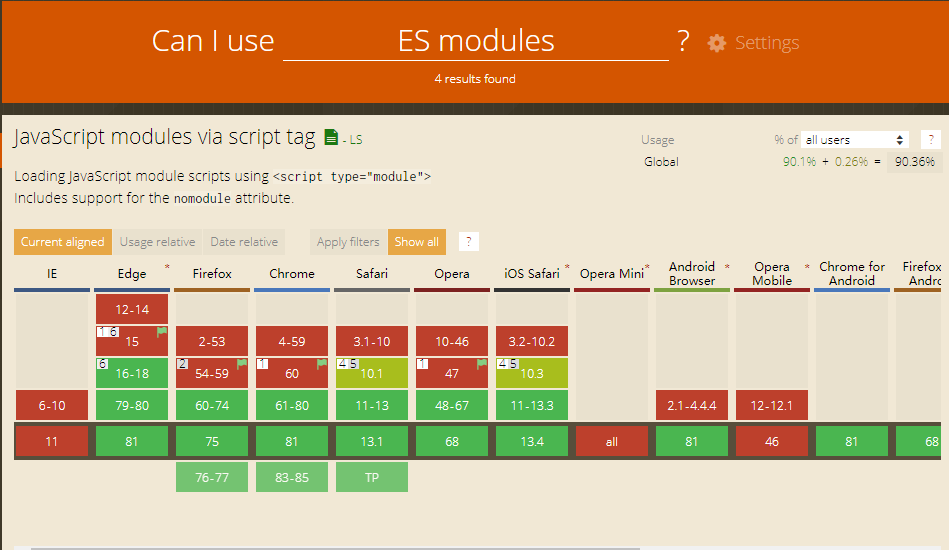

### 基本概念
systemjs是一个模块加载器，目前主流浏览器，如最新的chrome已经能很好的支持es module，并且对es6语法做了很多的优化，而我们在编写业务代码时一般使用es6语法，如果用babel进行转义一方面会使得代码的体积变大，另一方面也浪费了部分浏览器对最新语法的支持。所以我们采取的思路是支持es module的使用最新的语法，不支持的用babel进行编译，systemjs做模块加载。

script标签的type=module属性可以让浏览器在支持es module条件下下载执行标签下的脚本，type=nomodule属性让不支持es module的浏览器走另外的分支。


```
// 不支持esmodule
<script type="nomodule">

</script>

<script type="module">

</script>
```
### esmodule浏览器支持率


### 用法
对脚本进行babel编译
```@babel/core,  @babel/cli, @babel/plugin-transform-modules-systemjs```

```
// .babelrc
{
  "plugins": ["@babel/plugin-transform-modules-systemjs"]
}
```

es6版本
```
// index.js
export const a = 12

```

// babel编译后的版本
```
// index.bundle.js
System.register([], function (_export, _context) {
  "use strict";

  var a;
  return {
    setters: [],
    execute: function () {
      _export("a", a = 12);
    }
  };
});

```


使用：
```
// ie11版本不支持promise,bluebird是精简版的promise polyfill
<script src="https://cdn.bootcdn.net/ajax/libs/bluebird/3.7.2/bluebird.core.min.js" nomodule></script>
// 引入systemjs
<script src="https://cdn.bootcdn.net/ajax/libs/systemjs/6.3.1/s.js" nomodule></script>

<script nomodule >
  System.import("./index-bundle.js").then(function(a) {
    console.log(a)
  })
</script>

<script type="module">
  import("./index.js").then(({ a }) => {
    console.log(a)
  })
</script>
```


### 使用webpack完成自动化配置

后续补齐
