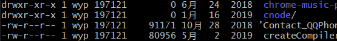

### node和数据库
node 不适合操作mysql，因为为了提高mysql效率，必须有连接池，但是node并不方便。
相比mysql，node更适合支持对象形数据库 - mongodb

### 热部署的概念
部署过程中用户的请求不受影响。不需要中断程序运行。


### 系统文件常识

linux 查看文件权限 ls -al

权限分配    文件所有者(自己)   文件所属组(家人)   其他用户(陌生人)
权限项          读                 写               执行
字符表示        r                  w                x
数字            4                  2                1 



其他字符:
d   目录文件
p   管道文件
l   连接文件
-   普通文件


另外：window 默认可读可写不可执行   字符表示为：666


### fs.read 和 fs.readFile的区别
fs.read和fs.readFile都是读取文件，但是fs.read更加灵活，readFile方法可以很方便的读取文件的全部内容。read可以指定读取的内容数，使用更加灵活。

如何用fs.read实现fs.readFile

```
// fs.readFile
fs.readFile('./data.txt', { encoding: 'utf-8' }, (err, data) => {
    console.log(data)
})

// fs.read
function simReadFile(path, callback) {
    // 获取文件大小
  fs.stat(path, (err, data) => {
    let size = data.size;
    // 指定buffer大小
    let buffer = Buffer.alloc(size)
    fs.open(path, 'r', (err, fd) => {
        // fd 为文件描述符
      fs.read(fd, buffer, 0, size, 0, callback)
    })
  })
}

simReadFile('./data.txt', (err, bype, data) => {
  console.log(data.toString())
})
```


### Stream对象
##### 概念的理解
流的本质是让数据流动起来。node中的stream对象是eventEmitter对象的一个实例(可以监听data,open,close事件)。传统的数据读取和写入是一次性读取完毕再处理，一次性读取过程会把内容放到缓存中，如果文件过大会出现内存效率问题。而stream是逐段读取，适合大数据和大文件的处理。

```
const fs = require('fs')
const rs = fs.createReadStream('data.txt')
let data = ""
rs.on('data', chunk => {
    // chunk 二进制buffer
    data += chunk
})
rs.on('end', () => {
    console.log('读取成功')
})

```
```
const fs = require('fs')
const rs = fs.createReadStream('data.txt')
const ws = fs.createWriteStream('data.txt')
rs.on('data', chunk => {
    ws.write(chunk)
})
rs.on('end', () => {
    console.log('读取成功')
})
```

需要注意的是：读取大文件写入时，可读流和可写流有可能数据不一致，导致数据的丢失，所以需要引入管道(pipe)

**pipe是可读流的方法，保证读写速度，防止数据丢失**

```
const rs = fs.createReadStream('./data.txt')
const ws = fs.createWriteStream('./data1.txt')
rs.pipe(ws)
```

另外process.stdin/stdout也是标准的输入输出流
```
process.stdout.write('input')
process.stdin.on('data', (chunk) => {
  if(chunk.toString() == 1) {
    process.stdin.emit('end')
  }
})
process.stdin.on('end', () => {
  process.stdout.write('end')
})
```

#### stream的分类

node中流的类型有4种：
    1. 可读流
    2. 可写流
    3. duplex: 双工流  例子：net.socket
    4. transform: 转换流

如何使用
    可读流:
        有两种模式，一种是自动流动flowing模式，另一种是手动流动paused模式
        1. rs.on('data', () => {})
        2. rs.on('readalbe', () => {
            while((chunk = rs.read())!== null) {
                data += chunk
            }
        })

应用：
```
const zlib = require('zlib')
fs.createReadStream('./data.txt')
    .pipe(zlib.createGzip())
    .pipe(fs.createWriteStream('data.txt.gz'))
```

### 为什么node中io操作都是基于二进制buffer
数据格式未知，字符串，asic码，音频，网络包等，编码方式各不相同，只有二进制才能统一识别。


### net模块

net:  基于tcp的封装
http: 在net基础上，做了比较多的数据封装

http 会将收发的数据按照 HTTP 协议自动帮你解析和包装
例如 http 模块自动将请求报文解析出来，然后挂载给了 req 请求对象。你可以通过 req 请求对象去拿到你想要的信息

为什么既有 net 又有 http 呢？
    http 只是一个基于 net 之上的一个模块，该模块遵循的 http 协议
    会对收发的数据进行 协议格式解析和包装

```
// server
const net = require('net')

const server = net.createServer()

server.listen(3001)

server.on('listening', () => {
  console.log('监听成功 3001')
})

// 新连接建立
server.on('connection', socket => {
  console.log('有新的连接')
  socket.on('data', chunk => {
    console.log('client发来信息:'
      , chunk.toString())
    // 返回数据
    socket.write("成功接受了！")
  })
  // 断开服务端
  // server.close()
})

server.on('close', () => {
  console.log('服务端断开连接')
})
```

```
// client
const net = require('net')
const netSocket = net.connect('3001')

netSocket.on('error', (err) => {
  console.log("有错误: " + err)
})


netSocket.on('connect', () => {
  console.log('客户端与服务端连接建立')
  netSocket.write('我是客户端')
  // 接收
  netSocket.on('data', (chunk) => {
    console.log('客户端收到：', chunk.toString())
    // 断开客户端连接
    // netSocket.end()
  })
})

netSocket.on('end', () => {
  console.log("客户段关闭")
})
```