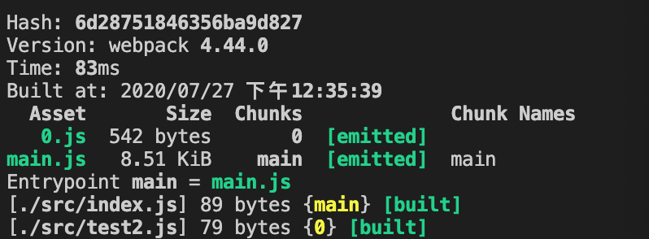

## webpack4

#### 文件指纹区别
Hash:和整个项目目的构建相关，只要项目目文文件有修改，整个项目目构建的 hash 值就会更更改
Chunkhash :和 webpack 打包的 chunk 有关，不同的 entry 会生生成不不同的 chunkhash 值
Contenthash:根据文文件内容来定义 hash ，文文件内容不不变，则 contenthash 不变

#### watch原理
webpack中watch的原理是利用轮询，判断文件最后编辑时间是否改变，某个文件发生改变，并不会立即通知，而是缓存起来，汇总得到轮询在一起返回。


#### 原理
webpack实现了commonjs规范，commonjs是node的模块化，而commonjs是同步阻塞式加载，为了实现commonjs规范，，webpack封装了自己的模块化，把所有模块和模块之间的依赖都展平，并以key：value都形式将模块展平后的对象传给一个闭包函数。
```
(function(modules) { // webpackBootstrap
  // The module cache
  // 缓存模块
	var installedModules = {};
	// The require function
	function __webpack_require__(moduleId) {
		// Check if module is in cache
		// 检查缓存模块，分析过的模块做混存
		if(installedModules[moduleId]) {
			return installedModules[moduleId].exports;
		}
		// Create a new module (and put it into the cache)
		// 构建新的模块化规范
		// installedModules {
		//  [moduleId]: {
		//      exports: {
		//      },
		//      i: moduleId,
		//      l: false
		//  }
		// }
		var module = installedModules[moduleId] = {
			i: moduleId,
			l: false,
			exports: {}
		};
		// Execute the module function
		// 函数执行，绑定this
		// module，module.exports, __webpack_require__作为参数形式传递给函数
		modules[moduleId].call(module.exports, module, module.exports, __webpack_require__);
		// Flag the module as loaded
		// 标记模块已经加载完毕
		module.l = true;
		// Return the exports of the module
		return module.exports;
	}
	// expose the modules object (__webpack_modules__)
	__webpack_require__.m = modules;
	// expose the module cache
	__webpack_require__.c = installedModules;
	// define getter function for harmony exports
	__webpack_require__.d = function(exports, name, getter) {
		if(!__webpack_require__.o(exports, name)) {
			Object.defineProperty(exports, name, { enumerable: true, get: getter });
		}
	};
	// define __esModule on exports
	__webpack_require__.r = function(exports) {
		if(typeof Symbol !== 'undefined' && Symbol.toStringTag) {
			Object.defineProperty(exports, Symbol.toStringTag, { value: 'Module' });
		}
		Object.defineProperty(exports, '__esModule', { value: true });
	};
	// create a fake namespace object
	// mode & 1: value is a module id, require it
	// mode & 2: merge all properties of value into the ns
	// mode & 4: return value when already ns object
	// mode & 8|1: behave like require
	__webpack_require__.t = function(value, mode) {
		if(mode & 1) value = __webpack_require__(value);
		if(mode & 8) return value;
		if((mode & 4) && typeof value === 'object' && value && value.__esModule) return value;
		var ns = Object.create(null);
		__webpack_require__.r(ns);
		Object.defineProperty(ns, 'default', { enumerable: true, value: value });
		if(mode & 2 && typeof value != 'string') for(var key in value) __webpack_require__.d(ns, key, function(key) { return value[key]; }.bind(null, key));
		return ns;
	};
	// getDefaultExport function for compatibility with non-harmony modules
	__webpack_require__.n = function(module) {
		var getter = module && module.__esModule ?
			function getDefault() { return module['default']; } :
			function getModuleExports() { return module; };
		__webpack_require__.d(getter, 'a', getter);
		return getter;
	};
	// Object.prototype.hasOwnProperty.call
	__webpack_require__.o = function(object, property) { return Object.prototype.hasOwnProperty.call(object, property); };
	// __webpack_public_path__
	__webpack_require__.p = "";
	// Load entry module and return exports
	return __webpack_require__(__webpack_require__.s = "./src/index.js");
})
/************************************************************************/
({

  "./src/index.js": (function(module, exports) {
      const result = "webpack4"//# sourceURL=webpack:///./src/index.js?;
    })

});
```

##### 动态加载，按需加载
```
import('./test.js').then(result => {
   ··· 
})
```
最终test.js会作为额外的chunk独立打包出来，默认的命名按数字递增，```0.js```


原理：
异步模块会在维护一个webpackJsonp队列，将模块chunkname和模块内容保存到队列中。
```
（window["webpackjsonp"].push([0], {
    "./src/test.js": (function(module, __webpack_exports__, __webpack_require__) {
        ···
    })
})
```

主模块通过```__webpack_require__.e(0).then()```的方式引入异步模块，e函数的实现逻辑就是动态插入script标签
```
__webpack_require__.e = function requireEnsure(chunkId) {
 		var promises = [];


 		// JSONP chunk loading for javascript

 		var installedChunkData = installedChunks[chunkId];
 		if(installedChunkData !== 0) { // 0 means "already installed".

 			// a Promise means "currently loading".
 			if(installedChunkData) {
 				promises.push(installedChunkData[2]);
 			} else {
 				// setup Promise in chunk cache
 				var promise = new Promise(function(resolve, reject) {
 					installedChunkData = installedChunks[chunkId] = [resolve, reject];
 				});
 				promises.push(installedChunkData[2] = promise);

 				// start chunk loading
 				var script = document.createElement('script');
 				var onScriptComplete;

 				script.charset = 'utf-8';
 				script.timeout = 120;
 				if (__webpack_require__.nc) {
 					script.setAttribute("nonce", __webpack_require__.nc);
 				}
 				script.src = jsonpScriptSrc(chunkId);

 				// create error before stack unwound to get useful stacktrace later
 				var error = new Error();
 				onScriptComplete = function (event) {
 					// avoid mem leaks in IE.
 					script.onerror = script.onload = null;
 					clearTimeout(timeout);
 					var chunk = installedChunks[chunkId];
 					if(chunk !== 0) {
 						if(chunk) {
 							var errorType = event && (event.type === 'load' ? 'missing' : event.type);
 							var realSrc = event && event.target && event.target.src;
 							error.message = 'Loading chunk ' + chunkId + ' failed.\n(' + errorType + ': ' + realSrc + ')';
 							error.name = 'ChunkLoadError';
 							error.type = errorType;
 							error.request = realSrc;
 							chunk[1](error);
 						}
 						installedChunks[chunkId] = undefined;
 					}
 				};
 				var timeout = setTimeout(function(){
 					onScriptComplete({ type: 'timeout', target: script });
 				}, 120000);
 				script.onerror = script.onload = onScriptComplete;
 				document.head.appendChild(script);
 			}
 		}
 		return Promise.all(promises);
 	};
```
问题： 
    异步模块是webpack自身内部维护的模块，chunk的名称0，1，2只能被主模块识别和维护，这导致无法不同项目中共享模块。
webpack4的解决方式：加入webpackChunkName, 但是这依然存在问题，命名容易出现冲突，特别是多团队不好管理。

```
import(/*webpackChunkName:"test"*/'./index.js').then(_ => {

})
```


## webpack5新特性
1. 速度快
2. 自身会带各种插件功能，不需要依赖第三方插件
3. 脱离cache loader, 自身完成缓存
4. 深度tree-shaking   webpack4 需要安装插件 类似prepack
5. 模块化 -> 微前端


webpack
	分阶段 => 生命周期

控制整个构建流程的阶段  => compiler
	对应阶段 => call => tap() => 要做的事情

	负责不同的阶段，把不同阶段生命周期的狗子挂载到身上

	初始化所有插件， 把不同阶段要做的事情，添加到对饮更多钩子里面
	到不同阶段的时候，出发对应的插件钩子，调用对应的逻辑


编译代码 => compiltion

1. 编译runloader
2. ast => addModule
3. dependency
	```
	{
		name: 'a.js',
		code: '',
		dep: [],
		ast: ''
	}

	```
4. 基于基础模板，构建模板，遍历依赖
5. 生成文件