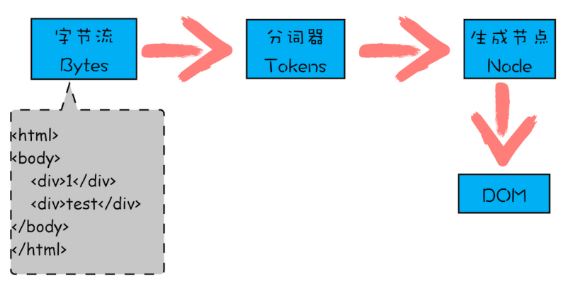

### 输入url到页面显示发生了什么


```performance.timing```

过程总结如下：
1. 处理重定向(判断)/卸载旧页面  (如何优化：取缓存的内容，本地重定向，强缓存)     
2. 有缓存则从本地拿缓存。      (如何优化：固态硬盘SSD比机械硬盘快, 尽可能的减少碎文件)    
3. 没有缓存，则需要进行DNS解析      
4. TCP握手-传输层      TCP -> TLS安全连接(为了https)(如何优化：增加带宽，反向代理的处理能力，保持长连接keep-alive)            
5. HTTP请求                     
6. 服务器响应response        (如何优化： 优化服务器响应，请求处理)     
7. processing

    7.1 HTML解析器将html解析成DOM树
    
    7.2 解析css成CSSOM
    
    7.3 将cssom的样式规则绑定到DOM树上，生成render树

    7.4 布局：对render树进行分层，生产layout tree

    7.5 绘制：为每个图层生成绘制的列表(绘制规则)，此时渲染引擎的主线程工作完毕，接下来会将绘制列表提交到合成线程(渲染引擎)

    7.6 合成线程会将图层进行分块。

    7.7 光栅线程会将图块进行光栅化。

    7.8 光栅后的结果提交给GPU线程。

8. 显示：数据放到共享内存，调用GPU进行运算，运算结果放到显存上显示。


**domcomplete是dom在内存中渲染完**


### 关于DNS解析

后缀
.com.cn
.org
.cn

一级域名
baidu.com

二级域名
www.baidu.com

过程：
浏览器将域名发给域名服务器，域名服务器只做中转和缓存。
DNS根服务器根据后缀派发到二级解析服务器，二级服务器根据一级域名派发到具体的三级域名服务器，以此类推。最终将最后的结果返回给最原始的域名服务器返回给浏览器。

### 关于CDN概念
CDN是资源的分布式分发，是用来优化链路的


### 现代浏览器的结构


浏览器引擎是处理1-2的过程，包括调用网络请求
渲染引擎处理7以后的过程(渲染页面)

### 渲染引擎
#### 渲染引擎结构和工作流程

#### 多线程的渲染引擎
渲染引擎里有多个线程，分别是：

    - 主线程，负责处理html，css，js不归浏览器引擎和渲染引擎负责，它归v8引擎处理，v8不能参与到渲染进程中，但是会影响

    - worker线程，service worker的js代码交由工作线程负责。

    - compositor线程-合成线程会根据绘制列表进行分块

    - Raster 线程，负责栅格化 - 把文档的结构、元素的样式、几何形状和绘制顺序转换为屏幕上的像素称为光栅化

**合成的好处是它可以在不涉及主线程的情况下完成。 合成线程不需要等待样式计算或 JavaScript 执行。 这就是合成动画是平滑性能的最佳选择的原因。 如果需要再次计算布局或绘图，则必须涉及主线程。**

### 常见的渲染引擎
Webkit 是 safari浏览器的内核
Blink(webkit fork) 是chrome，opera的内核。

chrome浏览器，一个域一个进程


### DOM树如何生成
HTML 解析器（HTMLParser） ⽹络进程加载了多少数据，HTML 解析器便解析多少数据。 ⽹络进程接收到响应头之后，会根据响应头中的 content-type 字段来判断⽂件的类型，⽐如 content- type 的值是“text/html”，那么浏览器就会判断这是⼀个 HTML 类型的⽂件，然后为该请求选择或 者创建⼀个渲染进程。渲染进程准备好之后，⽹络进程和渲染进程之间会建⽴⼀个共享数据的管道， ⽹络进程接收到数据后就往这个管道⾥⾯放，⽽渲染进程则从管道的另外⼀端不断地读取数据，并同 时将读取的数据“喂”给 HTML 解析器。你可以把这个管道想象成⼀个“⽔管”，⽹络进程接收到的 字节流像⽔⼀样倒进这个“⽔管”，⽽“⽔管”的另外⼀端是渲染进程的 HTML 解析器，它会动态接 收字节流，并将其解析为 DOM。




- 1. 通过分词器将字节流转换为 Token。 
- 2. 第⼆个和第三个阶段是同步进⾏的，需要将 Token 解析为 DOM 节点，并将 DOM 节点添加到 DOM 树中。

### js，css如何影响dom解析

1. html解析和css解析是两个并行的过程，不会相互影响。(css需要放到head上,靠前解析css，合并成render树的时间也会提前)
2. chrome浏览器做了优化，其中有一个预解析的操作。当渲染引擎开始收到字节流时，会开启一个预解析的线程，分析html中包含的js和css，提前下载文件。
3. js是由v8引擎去解析和执行的，由于js可以操作dom，所以渲染引擎和js引擎是互斥的。遇到js脚本需要执行时，渲染引擎会暂停让渡给js引擎工作，所以js会影响dom的解析。(js放到html底部，让dom解析完毕后再执行js脚本，更块的完成页面的展示)
4. js下载过程虽然提前，但是速度一般都比解析html慢，所以当遇到script标签，而脚本还没下载完成时，也会阻塞DOM的解析。
4. css会影响js脚本的执行。js脚本在解析时，需要先解析完js语句之上所有的css样式，解析完cssom后才会执行js脚本，所以样式文件会阻塞js的执行。
